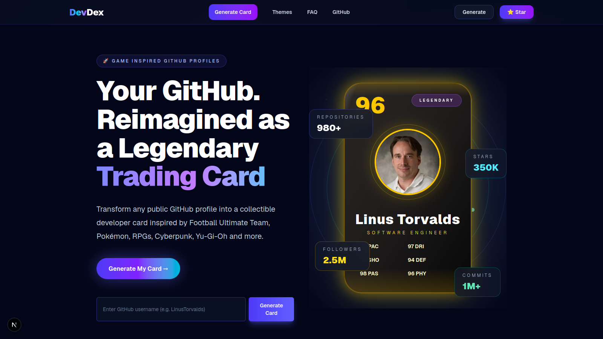
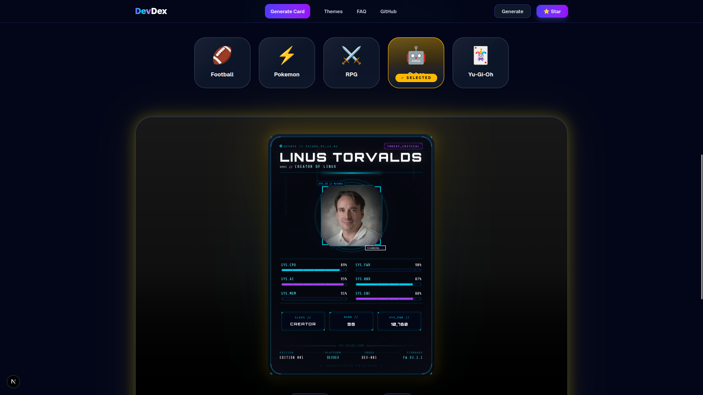

<div align="center">

# 🎴 DevDex

### Transform any GitHub profile into collectible developer cards.

Create stunning game-inspired cards from your GitHub profile in seconds.  
Inspired by Football Ultimate Team, Pokémon, Cyberpunk, RPGs, and Trading Cards.


[](https://nextjs.org/)
[](https://www.typescriptlang.org/)
[](https://tailwindcss.com/)
[](https://www.framer.com/motion/)

</div>

---

# 📖 Overview

DevDex is a modern web application that converts public GitHub profiles into premium collectible developer cards.

Instead of showing repositories as plain lists, DevDex analyzes developer activity and presents it through beautifully designed cards inspired by popular games.

Whether you're a student, open-source contributor, recruiter, or developer, DevDex provides a fun and visually engaging way to showcase your coding journey.

---

# 📸 Showcase

<div align="center">

### 🏠 Landing Page



<br><br>

### 🎴 Developer Card Preview



</div>

---

# ✨ Features

## 🎴 Multiple Card Themes

Choose between multiple professionally designed card styles.

- ⚽ Football Ultimate
- ⚡ Monster Trainer
- 🛡 Fantasy RPG
- 🤖 Cyberpunk
- 🃏 Trading Card

---

## 📊 GitHub Analysis

DevDex automatically analyzes:

- Public repositories
- Programming languages
- Stars
- Forks
- Organizations
- Followers
- Contributions
- Developer statistics

---

## ⭐ Smart Rating System

Every profile receives an overall rating calculated from GitHub activity.

Examples:

```
Overall Rating
Attack
Defense
Speed
Teamwork
Intelligence
Versatility
```

---

## 📤 Export Studio

Export your cards in multiple formats.

- PNG
- High Resolution
- Social Media Ready

---

# 🚀 Tech Stack

## Frontend

- Next.js 16
- React 19
- TypeScript
- TailwindCSS
- Framer Motion

---

## APIs

- GitHub REST API

---

## Tools

- ESLint
- Prettier
- Vercel

---

# 📂 Project Structure

```text
src
│
├── app
│
├── components
│   ├── animations
│   ├── cards
│   ├── export
│   ├── layout
│   ├── profile
│   ├── sections
│   └── theme
│
├── lib
│   ├── github
│   └── themes
│
├── types
│
└── utils
```

---

# ⚙ Installation

Clone the repository.

```bash
git clone https://github.com/yourusername/devdex.git
```

Go inside.

```bash
cd devdex
```

Install dependencies.

```bash
npm install
```

Run development server.

```bash
npm run dev
```

---

# 🔑 Environment Variables

Create

```
.env.local
```

```env
GITHUB_TOKEN=your_github_token
```

Using a GitHub Personal Access Token increases API rate limits significantly.

---

# 🤝 Contributing

Contributions are welcome.

1. Fork the repository
2. Create your branch

```bash
git checkout -b feature/amazing-feature
```

3. Commit

```bash
git commit -m "Add amazing feature"
```

4. Push

```bash
git push origin feature/amazing-feature
```

5. Open a Pull Request

---

# ⭐ Why DevDex?

GitHub profiles are informative—but they aren't always engaging.

DevDex reimagines developer portfolios as collectible cards, combining creativity, design, and software engineering into an experience that's fun to explore and easy to share.

---

# 📜 License

Distributed under the MIT License.

See `LICENSE` for more information.

---

# 👨‍💻 Author

**Akash**

GitHub

https://github.com/Senpai-Akash

---

<div align="center">

### ⭐ If you like DevDex, consider giving the repository a star.

Made with ❤️ using Next.js, TypeScript and TailwindCSS.

</div>